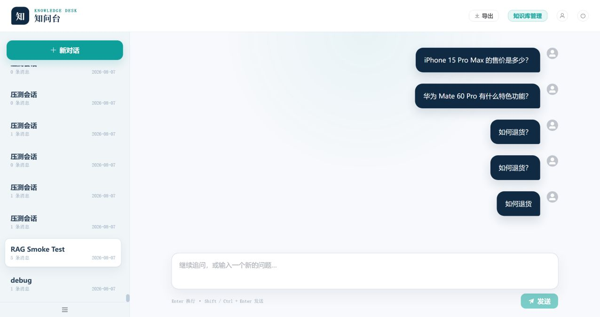
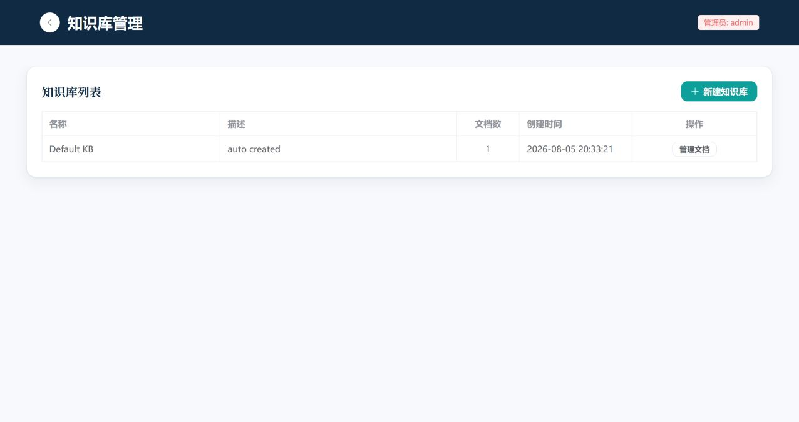
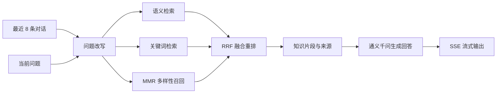

# 🧠 知问台：支持多轮追问与混合检索的 RAG 知识库

知问台是一个基于 **LangChain、FastAPI、ChromaDB 与 Vue 3** 的知识库问答项目。你可以上传 PDF、Word、Excel 或 Markdown 文档，再通过自然语言连续提问；系统会结合对话上下文改写问题，并融合语义、关键词与 MMR 检索结果，最后由通义千问生成带来源的流式回答。

## ✨ 界面预览

### 聊天工作台



### 知识库管理



## 🚀 核心能力

- **多轮追问**：参考最近 8 条对话，将“它有什么特点？”这类追问改写为可独立检索的问题。
- **混合检索**：融合语义检索、BM25 风格关键词检索与 MMR 多样性召回，并通过 RRF 重排。
- **文档知识库**：支持 PDF、Word、Excel、Markdown 的上传、解析、分块与向量入库。
- **流式问答**：使用 SSE 实时输出回答，并展示引用来源。
- **会话管理**：保存、切换、删除和导出历史对话。
- **用户认证**：提供 JWT 登录、注册及个人信息管理。
- **两级缓存**：使用内存 LRU 与 diskcache 缓存高频结果。

## 🔎 RAG 工作流程



### 多轮问答示例

```text
用户：小米 14 Ultra 的主要配置是什么？
助手：它搭载骁龙 8 Gen 3，并配备徕卡影像系统……

用户：那它支持卫星通信吗？
系统改写：小米 14 Ultra 是否支持卫星通信？
助手：根据知识库资料……
```

## 🛠️ 技术栈

| 层级 | 技术 |
| --- | --- |
| 大模型 / Embedding | 通义千问 `qwen-plus` / `text-embedding-v2` |
| RAG | LangChain、语义检索、关键词检索、MMR、RRF |
| 后端 | FastAPI、Uvicorn、SQLAlchemy、JWT |
| 数据 | ChromaDB、SQLite、diskcache |
| 前端 | Vue 3、Element Plus、Pinia、Vite |
| 测试 | pytest、pytest-asyncio、pytest-cov、Locust |

## 📦 快速开始

### 环境要求

- **Python 3.11（推荐）**，最低 Python 3.10
- **Node.js 18+**
- [阿里云百炼 API Key](https://bailian.console.aliyun.com/)

### 1. 克隆并配置项目

```powershell
git clone https://github.com/summerlri/langchain-rag-system.git
cd langchain-rag-system
Copy-Item .env.example .env
```

编辑 `.env`，至少填写：

```env
DASHSCOPE_API_KEY=sk-your-real-key-here
```

### 2. 安装后端依赖

```powershell
python -m venv venv
.\venv\Scripts\Activate.ps1
python -m pip install --upgrade pip
pip install -r requirements.txt
```

### 3. 安装前端依赖

```powershell
Set-Location frontend
npm install
Set-Location ..
```

如果 PowerShell 阻止执行 `npm.ps1`，可将命令替换为 `npm.cmd install` 和 `npm.cmd run dev`。

### 4. 初始化数据

```powershell
python -m backend.db.init_db
python scripts/seed_data.py
```

### 5. 启动项目

最简单的方式是在项目根目录运行：

```powershell
.\start.bat
```

也可以分别启动：

```powershell
# 终端 1：后端
uvicorn backend.main:app --host 0.0.0.0 --port 8000 --reload

# 终端 2：前端
Set-Location frontend
npm run dev
```

启动后访问：

- 前端：http://localhost:5173
- API 文档：http://localhost:8000/docs
- 健康检查：http://localhost:8000/health

## 👤 默认账号

| 用户名 | 密码 | 角色 |
| --- | --- | --- |
| `admin` | `123456` | 管理员 |

> ⚠️ 默认账号只适合本地体验。对外部署前请修改默认密码与 `JWT_SECRET_KEY`。

## 🧪 运行测试

先安装开发与测试依赖：

```powershell
pip install -r requirements-dev.txt
```

运行完整测试和覆盖率统计：

```powershell
pytest tests/ -v --cov=backend --cov-report=term-missing --cov-report=html:reports/coverage
```

也可以按模块运行：

```powershell
pytest tests/unit/ -v
pytest tests/api/ -v
pytest tests/rag/ -v
```

当前功能分支验证结果：**114 项测试通过，后端覆盖率 64%**。

### 压力测试

```powershell
locust -f tests/locustfile.py --host=http://localhost:8000
```

打开 http://localhost:8089 后，可自行设置并发用户数与启动速度。SQLite 已启用 WAL 和 `busy_timeout` 来改善本地并发访问，但它仍更适合单机演示与中小规模使用；实际并发能力取决于硬件、请求类型与数据量，正式部署前应以压测结果为准。

## ⚙️ 主要配置

| 变量 | 说明 | 默认值 |
| --- | --- | --- |
| `DASHSCOPE_API_KEY` | 阿里云百炼 API Key | 必填 |
| `QWEN_MODEL` | 对话模型 | `qwen-plus` |
| `EMBEDDING_MODEL` | 文本嵌入模型 | `text-embedding-v2` |
| `DATABASE_URL` | SQLite 数据库地址 | `sqlite+aiosqlite:///./data/rag.db` |
| `CHROMA_PERSIST_DIR` | ChromaDB 持久化目录 | `./data/chroma` |
| `UPLOAD_DIR` | 上传文件目录 | `./data/uploads` |
| `CACHE_DIR` | 缓存目录 | `./data/cache` |
| `JWT_SECRET_KEY` | JWT 签名密钥 | 部署前必须修改 |

## 📁 项目结构

```text
backend/              FastAPI 后端、RAG 流程、数据模型与缓存
frontend/             Vue 3 前端
scripts/              测试知识文档生成脚本
tests/                单元、API、RAG 与压力测试
docs/images/          README 界面截图
data/                 本地数据库、向量、缓存与上传文件
requirements.txt      运行依赖
requirements-dev.txt  开发与测试依赖
start.bat             Windows 一键启动脚本
```

## 📄 License

MIT
